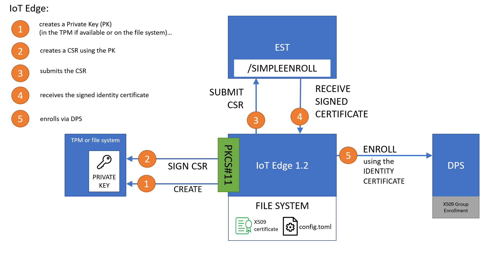

# Overview
Some notes around how to use an EST server to dynamically issue device identity certificates for IoT Edge 1.2.

Related repos:
* containerized EST server - https://github.com/arlotito/est-server-docker
* using TPM/PKCS11 with IoT Edge 1.2 - https://github.com/arlotito/iot-edge-1.2-tpm
* super simple bash CA - https://github.com/arlotito/my-simple-bash-ca

**DISCLAIMER: Samples in this repo are for demonstration purposes only! This is not a guidance or best practices around IoT Edge.**

## Background
The IoT Edge 1.2 can leverage an [EST](https://en.wikipedia.org/wiki/Enrollment_over_Secure_Transport) server to dynamically request/renew the *Device Identity* certificate needed to authenticate against the IoT HUB (directly or via the DPS).

The flow is as follows:


To enable that scenario, just edit the "cert_issuance" section of the config.toml of your IoT Edge:
```toml
# Cert issuance via EST
# ---------------------

# [cert_issuance.est]
# trusted_certs = [
#     "file:///var/secrets/est-id-ca.pem",
# ]
# 
# [cert_issuance.est.auth]
# username = "estuser"
# password = "estpwd"
#
# # EST ID cert already on device, or...
# identity_cert = "file:///var/secrets/est-id.pem"
#
# identity_pk = "file:///var/secrets/est-id.key.pem"            # file URI, or...
# identity_pk = "pkcs11:slot-id=0;object=est-id?pin-value=1234" # PKCS#11 URI
#
# # EST ID cert requested via EST bootstrap ID cert
# bootstrap_identity_cert = "file:///var/secrets/est-bootstrap-id.pem"
#
# bootstrap_identity_pk = "file:///var/secrets/est-bootstrap-id.key.pem"            # file URI, or...
# bootstrap_identity_pk = "pkcs11:slot-id=0;object=est-bootstrap-id?pin-value=1234" # PKCS#11 URI
#
# [cert_issuance.est.urls]
# default = "https://example.org/.well-known/est"
```

Those settings are related to:
* *[cert_issuance.est]*: the EST server certificate(s) that the client (i.e. IoT Edge) can trust
* *[cert_issuance.est.auth]*: how the client (i.e. IoT Edge) authenticates against the EST server. It can be:
    * username/psw 
    * mutual TLS authentication. In this case the client (IoT Edge) will use the provided *EST identity/boostrap* certificates to authenticate against the EST server
* *[cert_issuance.est.urls]*: the EST server URL

The EST will issue an *device identity certificate*, that can be used to provision the IoT Edge:
* automatically, via DPS
* manually, against a specific IoT HUB

To use the DPS, edit the following section of the config.toml:
```toml
## DPS provisioning with X.509 certificate
[provisioning]
source = "dps"
global_endpoint = "https://global.azure-devices-provisioning.net"
id_scope = "0ab1234C5D6"
 
[provisioning.attestation]
method = "x509"
registration_id = "my-device"

identity_cert = { method = "est", common_name = "my-device" }      # dynamically issued via EST, or...

# uncomment the line fitting your case (PK in the file system or in a PKCS11 store - for instance the TPM):
# identity_pk = "file:///var/secrets/device-id.key.pem"              # file URI, or...
# identity_pk = "pkcs11:slot-id=0;object=device%20id?pin-value=1234" # PKCS#11 URI
```

For manual provisioning (i.e. without no DPS), edit the following section instead:
```toml
## Manual provisioning with X.509 certificate
[provisioning]
source = "manual"
iothub_hostname = "example.azure-devices.net"
device_id = "my-device"

[provisioning.authentication]
method = "x509"

identity_cert = { method = "est", common_name = "my-device" }      # dynamically issued via EST, or...

# uncomment the line fitting your case (PK in the file system or in a PKCS11 store - for instance the TPM):
# identity_pk = "file:///var/secrets/device-id.key.pem"              # file URI, or...
# identity_pk = "pkcs11:slot-id=0;object=device%20id?pin-value=1234" # PKCS#11 URI
```

# References
* EST - Enrollment over Secure Transport ([here](https://en.wikipedia.org/wiki/Enrollment_over_Secure_Transport))
* An EST Sever in a docker container ([here](EST-server-setup.md))
* IoT Edge 1.2, EST and TPM ([here](https://github.com/arlotito/iot-edge-1.2-tpm))
* a super simple bash CA ([here](https://github.com/arlotito/my-simple-bash-ca))